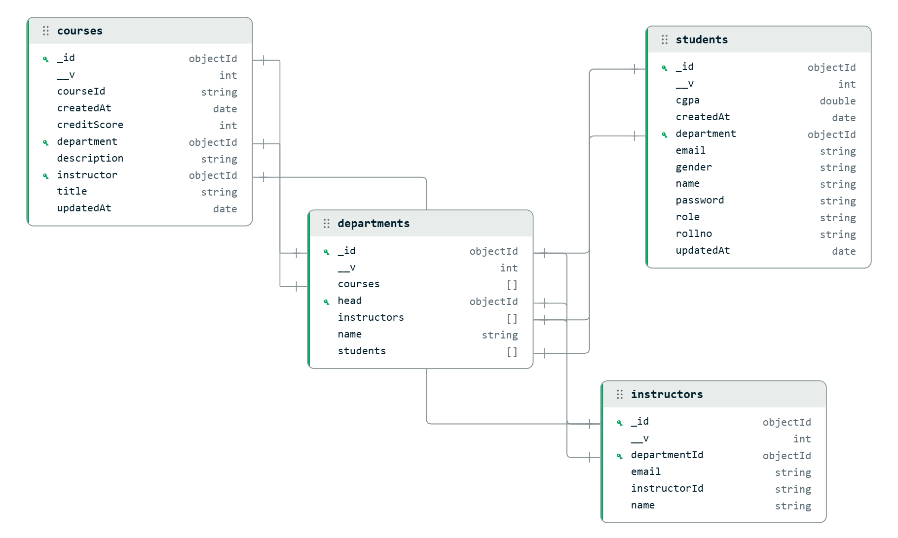

# 🏫 University Management System

This API provides a comprehensive solution for managing student records. It supports operations to create, retrieve, update, and delete student information, along with advanced query capabilities for filtering data based on specific criteria such as department and gender.


## Schema for the project



## Tools & Technologies
<p>


</p>


## Endpoints

### Get a Student by Roll Number

#### GET `/api/students/:rollno`

**Description**: Retrieves a student by their roll number.

**Parameters**:

- `rollno` (string, required): The roll number of the student to retrieve.

**Response**:

- `200 OK`: Returns the student data.
- `404 Not Found`: If the student is not found.

**Example Request**:

```http
GET /api/students/21cse203 HTTP/1.1
```

**Example Response**:

```json
{
    "_id": "60d5ec49db3a6e4898e5b9e1",
    "name": "Akash Kumar Patro",
    "email": "21cse203.akashkumarpatro@giet.edu",
    "rollno": "21cse203",
    "department": "CSE",
    "gender": "Male",
    "cgpa": 8.5
}
```

### Get Students by Query

#### GET `/api/students/q`

**Description**: Retrieves students based on department and/or gender.

**Query Parameters**:

- `department` (string, optional): The department of the students to retrieve.
- `gender` (string, optional): The gender of the students to retrieve.

**Response**:

- `200 OK`: Returns the list of students matching the query.
- `404 Not Found`: If no students are found.

**Example Request**:

```http
GET /api/students/q?department=CSE&gender=Male HTTP/1.1
```

**Example Response**:

```json
[
    {
        "_id": "60d5ec49db3a6e4898e5b9e1",
        "name": "Akash Kumar Patro",
        "email": "21cse203.akashkumarpatro@giet.edu",
        "rollno": "21cse203",
        "department": "CSE",
        "gender": "Male",
        "cgpa": 8.5
    }
]
```

### Get All Students

#### GET `/api/students`

**Description**: Retrieves all students.

**Response**:

- `200 OK`: Returns the list of all students.
- `404 Not Found`: If no students are found.

**Example Request**:

```http
GET /api/students HTTP/1.1
```

**Example Response**:

```json
[
    {
        "_id": "60d5ec49db3a6e4898e5b9e1",
        "name": "Akash Kumar Patro",
        "email": "21cse203.akashkumarpatro@giet.edu",
        "rollno": "21cse203",
        "department": "CSE",
        "gender": "Male",
        "cgpa": 8.5
    },
    {
        "_id": "60d5ec49db3a6e4898e5b9e2",
        "name": "Prakute Kumari",
        "email": "23me120.prakutekumari@giet.edu",
        "rollno": "23me120",
        "department": "ME",
        "gender": "Female",
        "cgpa": 9.0
    }
]
```

### Create a Student

#### POST `/api/students`

**Description**: Creates a new student.

**Request Body**:

- `name` (string, required): The name of the student.
- `email` (string, required): The email of the student.
- `rollno` (string, required): The roll number of the student.
- `department` (string, required): The department of the student.
- `gender` (string, required): The gender of the student.
- `cgpa` (number, required): The CGPA of the student.

**Response**:

- `201 Created`: Returns the created student data.
- `400 Bad Request`: If any required fields are missing.
- `404 Not Found`: If there's an error creating the student.

**Example Request**:

```http
POST /api/students HTTP/1.1
Content-Type: application/json

{
    "name": "Akash Kumar Patro",
    "email": "21cse203.akashkumarpatro@giet.edu",
    "rollno": "21cse203",
    "department": "CSE",
    "gender": "Male",
    "cgpa": 8.5
}
```

**Example Response**:

```json
{
    "message": "created student",
    "addedStudent": {
        "_id": "60d5ec49db3a6e4898e5b9e1",
        "name": "Akash Kumar Patro",
        "email": "21cse203.akashkumarpatro@giet.edu",
        "rollno": "21cse203",
        "department": "CSE",
        "gender": "Male",
        "cgpa": 8.5
    }
}
```

### Update a Student

#### PUT `/api/students/:rollno`

**Description**: Updates an existing student by their roll number.

**Parameters**:

- `rollno` (string, required): The roll number of the student to update.

**Request Body**: Any fields that need to be updated (e.g., `name`, `email`, `department`, etc.)

**Response**:

- `200 OK`: Returns the updated student data.
- `404 Not Found`: If the student is not found.

**Example Request**:

```http
PUT /api/students/21cse203 HTTP/1.1
Content-Type: application/json

{
    "cgpa": 8.7
}
```

**Example Response**:

```json
{
    "message": "update student data with 21cse203",
    "update": {
        "n": 1,
        "nModified": 1,
        "ok": 1
    }
}
```

### Delete a Student

#### DELETE `/api/students/:rollno`

**Description**: Deletes a student by their roll number.

**Parameters**:

- `rollno` (string, required): The roll number of the student to delete.

**Response**:

- `200 OK`: Returns a message confirming the deletion.
- `404 Not Found`: If the student is not found.

**Example Request**:

```http
DELETE /api/students/21cse203 HTTP/1.1
```

**Example Response**:

```json
{
    "message": "deleted student",
    "student": {
        "n": 1,
        "ok": 1,
        "deletedCount": 1
    }
}
```

---

This documentation covers the endpoints for managing student data, including creating, retrieving, updating, and deleting students, with query options for filtering by department and gender.
